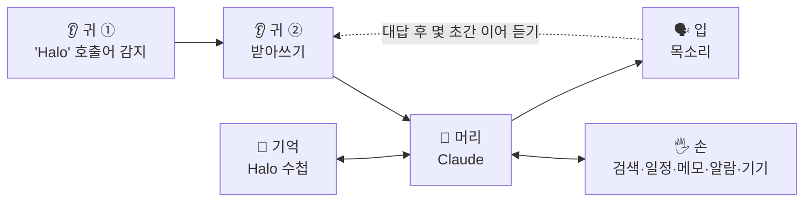

# Halo 설계

> "Halo" 하고 부르면 깨어나서, 내 생각을 함께 분석하고, 찾아보고, 정리하고, 집 기기까지 움직이는 나만의 AI 비서.

- 상태: 설계 초안 v0.1 (2026-10-05)
- 아직 정하지 않은 것은 [9. 결정할 것](#9-결정할-것)에 모아뒀어요.

## 1. 목표

| 항목 | 내용 |
|---|---|
| 이름 | Halo |
| 부르는 법 | "Halo" 하고 부르면 깨어남 |
| 기기 | 안드로이드 폰 |
| 하는 일 | 생각 대화·분석, 정보 찾기, 일정·메일·메모, 기기 조종 |
| 대화 방식 | 내 생각을 분석하고, 자기 생각을 말하고, 질문으로 돌려주는 티키타카 |

## 2. 구조

Halo는 다섯 부분으로 이뤄져요.

| 부분 | 하는 일 | 기술 | 비용 |
|---|---|---|---|
| 귀 ① 호출어 | 폰 안에서 "Halo"라는 소리만 계속 감지 | openWakeWord(오픈소스) 또는 Picovoice Porcupine(한국어 지원) | 무료 (Porcupine은 무료 등급 조건 확인 필요) |
| 귀 ② 받아쓰기 | 호출 뒤 한 말을 글자로 | 안드로이드 기본 음성 인식 | 무료 |
| 머리 | 생각해서 대답하고, 어떤 도구를 쓸지 정함 | Claude API | 쓰는 만큼 ([6. 비용](#6-비용)) |
| 기억 | 나에 대한 것과 지난 대화 | 폰 안에 저장하는 "Halo 수첩" | 무료 |
| 입 | 대답을 목소리로 | 안드로이드 기본 TTS(한국어) | 무료 |
| 손 | 실제 행동 | Claude 도구 사용 + 안드로이드 기능 | 웹 검색만 유료 |

호출어 기술은 "Halo" 발음에 따라 골라요. 영어식 "헤일로"면 openWakeWord로 직접 모델을 학습시키고, 한국어식 "할로"면 한국어 모델이 있는 Porcupine을 먼저 검토해요.

## 3. 한 번 주고받는 흐름

1. **대기**: Halo 앱이 백그라운드에서 "Halo"라는 소리만 들어요. 이때 소리는 폰 밖으로 나가지 않아요.
2. **호출**: "Halo"가 들리면 짧은 신호음을 내고 받아쓰기를 시작해요.
3. **전달**: 말이 끝나면 받아쓴 글을 Halo 수첩, 최근 대화와 함께 Claude에게 보내요.
4. **행동**: 필요하면 Claude가 도구를 써요. 예: 일정 확인, 웹 검색, 알람 설정.
5. **대답**: 대답을 문장 단위로 받는 대로 바로 읽어줘서 기다리는 시간을 줄여요.
6. **이어 듣기**: 대답이 끝나면 약 8초 동안 호출어 없이 이어서 들어요. "Halo"를 매번 부르지 않아도 티키타카가 이어져요.
7. **끝**: 조용하거나 "고마워, 끝"이라고 하면 1번 대기 상태로 돌아가요.

Halo가 말하는 동안에는 듣지 않아서 자기 목소리를 내 말로 착각하지 않아요. 말하는 중에 멈추고 싶으면 화면이나 알림의 버튼을 누르면 돼요.

## 4. 기능별 설계 (손)

| 기능 | 방법 | 난이도 | 비고 |
|---|---|---|---|
| 생각 대화·분석 | '생각 티키타카' 규칙을 Halo 성격에 맞게 옮김. "깊게 생각해줘"라고 하면 깊은 모드 | 쉬움 | 핵심 기능 |
| 정보 찾기 | Claude 웹 검색 도구 (날씨, 뉴스, 궁금한 것) | 쉬움 | 검색 1,000번에 $10. 설정에 지역을 적어두면 날씨를 그 지역 기준으로 찾음 |
| 알람·타이머 | 안드로이드 시계 앱 호출 | 쉬움 | 무료 |
| 일정 | 폰 캘린더(구글 캘린더와 동기화된 것) 읽기·추가 | 보통 | 구글 개발자 설정이 필요 없음 |
| 메모 | Halo 앱 안에 저장, 나중에 노션으로 보내기 | 쉬움 → 보통 | 노션은 연결 토큰 하나만 발급하면 됨 |
| 메일 | Gmail API | 어려움 | 구글 개발자 설정과 로그인 연결이 필요해서 마지막 단계에 |
| 기기 조종 | 가진 기기에 맞춰 연결 (SmartThings, Google Home, Home Assistant 등) | 기기에 따라 다름 | 가진 기기 목록이 필요 |

**행동 확인 규칙**: 기기 조종, 일정 추가, 메일 보내기처럼 무언가를 바꾸는 행동은 Halo가 실행 전에 "~할까요?" 하고 묻고, "응"이라고 해야 실행해요. 일정 보기나 검색처럼 읽기만 하는 일은 바로 해요.

## 5. 기억 (Halo 수첩)

- **Halo 수첩**: 나에 대한 중요한 사실(이름, 좋아하는 것, 진행 중인 고민, 목표 등)을 짧게 적어둔 메모예요. 매 대화에 같이 보내요.
- Claude가 대화 중에 기억할 만한 걸 발견하면 "수첩에 적기" 도구로 추가하거나 고쳐요.
- **대화 기록**: 최근 대화는 그대로 두고, 오래된 대화는 요약해서 보관해요.
- 모두 폰 안에만 저장돼요. 앱에서 수첩을 직접 보고 고치거나 지울 수 있어요.

## 6. 비용

### 두 가지 경로

| | A. Halo 페이지 (무료) | B. Halo 앱 (API) |
|---|---|---|
| 어디서 | claude.ai 안의 페이지 | 폰에 설치하는 앱 |
| "Halo" 부르기 | ✗ 키보드 🎤로 입력 | ✓ 화면이 꺼져 있어도 |
| 생각 대화·분석 | ✓ | ✓ |
| 정보 찾기 | ✗ | ✓ |
| 일정·메일·메모 | 메일·노션 ✓ (Claude에 연결된 계정 사용). 일정은 구글 캘린더를 Claude에 연결하면 가능 | 일정·메모 ✓, 메일은 마지막 단계 |
| 기기 조종 | ✗ | ✓ (기기에 따라) |
| 추가 비용 | 없음 (Claude 구독 사용량) | 월 약 $6~20 |

### B의 월 예상 비용

기준: 하루 30번 주고받기 + 웹 검색 5번 (한 달 약 900번), 프롬프트 캐싱 사용. 대략치예요.

| 머리 (Claude 모델) | 특징 | 월 예상 |
|---|---|---|
| Opus | 가장 똑똑함. 생각한 뒤 대답해서 첫마디가 조금 늦을 수 있음 | 약 $20 |
| Sonnet | 똑똑함과 속도의 균형 | 약 $10 |
| Haiku | 가장 빠르고 저렴. 깊은 분석은 약함 | 약 $6~9 |
| 섞어 쓰기 | 평소엔 Sonnet이나 Haiku, "깊게 생각해줘" 할 때만 Opus | 위의 중간 |

- 2026년 10월 기준 요금(100만 토큰당 입력/출력): Opus $4/$20, Sonnet $2/$10, Haiku $1/$5. 웹 검색은 1,000번에 $10.
- 받아쓰기, 목소리, 호출어는 폰 기본 기능이나 오픈소스라 무료예요.
- API는 Claude 구독과 **별도**로 Anthropic Console에서 선불 충전해서 써요. 충전한 금액을 다 쓰면 멈추고, 자동 충전을 켜지 않으면 그 이상은 나가지 않아요.
- 실제 비용은 대화 길이에 따라 달라져요. 앱에 이번 달 사용 금액을 보여주는 화면을 넣어요.

## 7. 안전과 개인정보

- **API 키는 저장소에 절대 넣지 않아요.** G-main 저장소는 공개라 누구나 볼 수 있어요. 키는 앱 설정 화면에 직접 입력하고, 폰 안에 암호화해서 저장해요.
- **소리**: 호출어 감지는 폰 안에서만 해요. "Halo"를 부른 뒤 한 말만 받아쓰기(구글)와 Claude(Anthropic)로 전송돼요.
- **듣는 중 표시**: 항상 듣는 동안 알림창에 "Halo가 듣고 있어요"가 떠 있고, 거기서 바로 끌 수 있어요.
- **행동 확인**: 무언가를 바꾸는 행동은 실행 전에 꼭 확인받아요 ([4. 기능별 설계](#4-기능별-설계-손)).
- **배터리**: 항상 듣기는 배터리를 써요. "충전 중에만 듣기" 옵션을 넣어요. 삼성 폰은 배터리 설정에서 Halo를 절전 예외로 둬야 꺼지지 않아요.

## 8. 만드는 순서

| 단계 | 내용 | 경로 | 결과 |
|---|---|---|---|
| 0 | Halo 페이지: 지금 '생각 티키타카'에 Halo 성격을 입히고 대화 방식 다듬기 | A (무료) | Halo의 성격 확정 |
| 1 | Halo 앱 기본: 버튼 누르고 말하기 → Claude → 목소리, Halo 수첩, 이어 듣기 | B | 말로 티키타카 |
| 2 | "Halo" 호출어로 항상 듣기 | B | 손 안 대고 부르기 |
| 3 | 손: 정보 찾기, 알람·타이머, 일정, 메모 | B | 비서 기능 |
| 4 | 기기 조종 | B | 집 기기 움직이기 |
| 5 | (선택) 메일, 노션 연결, 더 좋은 목소리 | B | 마무리 |

0단계에서 다듬은 성격과 대화 규칙은 그대로 앱으로 옮겨요.

### 앱을 만들고 설치하는 방법 (PC 없이)

1. Claude가 G-main 저장소에 앱 코드(Kotlin, 안드로이드 공식 언어)를 작성해요.
2. GitHub가 클라우드에서 설치 파일(APK)을 자동으로 만들어요 (GitHub Actions). PC가 필요 없어요.
3. 폰에서 APK를 받아 설치해요. 처음 한 번은 "출처를 알 수 없는 앱 설치"를 허용해야 해요. 직접 만든 앱이라 Play 프로텍트 경고가 뜰 수 있어요.
4. Claude는 실제 폰에서 테스트할 수 없어요. 써보고 증상을 알려주면 고쳐서 새 APK를 만들어요.

## 9. 결정할 것

| # | 질문 | 선택지 | 언제까지 |
|---|---|---|---|
| 1 | 어디서 시작할까? | 0단계(무료 페이지)부터 / 바로 1단계(앱) | 지금 |
| 2 | "Halo" 발음은? | "헤일로" / "할로" / 기타 | 2단계 전 |
| 3 | Halo의 성격과 말투 | 존댓말·반말, 나를 부르는 호칭, 재치 정도 | 0단계 |
| 4 | 머리로 쓸 모델 | Opus / Sonnet / Haiku / 섞어 쓰기 | 1단계 전 |
| 5 | 가진 스마트 기기 | 제품 이름과 쓰는 앱 (SmartThings 등) | 4단계 전 |
| 6 | 폰 기종과 안드로이드 버전 | 예: 갤럭시 S24, Android 15 | 1단계 전 |

## 10. 검토했지만 고르지 않은 방법

- **브라우저 페이지로 항상 듣기** (GitHub Pages): 안드로이드 크롬은 화면이 켜져 있고 페이지가 앞에 떠 있을 때만 듣고, 기기에 따라 듣기를 다시 시작할 때마다 신호음이 나요. 호출어 비서로는 불안정해서 앱으로 가요.
- **Home Assistant**: 기기 조종과 호출어를 잘 지원하지만, 집에 항상 켜둔 서버(라즈베리파이나 미니 PC)가 필요해요. 4단계에서 기기가 많으면 다시 검토해요.
- **Claude 앱 음성 모드**: 무료로 손 안 대고 대화할 수 있지만, "Halo" 호출어와 기기 조종은 안 돼요.

## 11. 구현 메모 (개발용)

- 코드 구조는 [halo/README.md](../halo/README.md)에 있어요. 두뇌 부분(`core`)은 순수 Kotlin이라 안드로이드 없이 테스트할 수 있고, `app`이 화면과 음성을 맡아요.
- 언어와 UI: Kotlin. 화면 구성 방식은 1단계에서 정해요.
- Claude 호출: Anthropic Java SDK(Kotlin에서 사용), 스트리밍, 도구 사용, 프롬프트 캐싱. 성격·규칙·도구 정의처럼 바뀌지 않는 부분을 앞에 두고 캐시해요.
- 항상 듣기: 마이크 타입 포그라운드 서비스. 앱이 화면에 떠 있을 때 시작해야 해요(안드로이드 14 이상 제약).
- 마이크는 한 번에 하나만 써요: 호출어 감지 → 받아쓰기로 넘어갈 때 호출어 감지를 멈추고, 끝나면 다시 켜요.
- 저장: 대화 기록과 Halo 수첩은 폰 안 데이터베이스. API 키는 Android Keystore로 암호화.
- 서명 키 고정: 빌드마다 같은 서명 키를 써야 새 버전을 덮어 설치할 때 수첩과 기록이 지워지지 않아요. 방법은 1단계에서 정해요.
